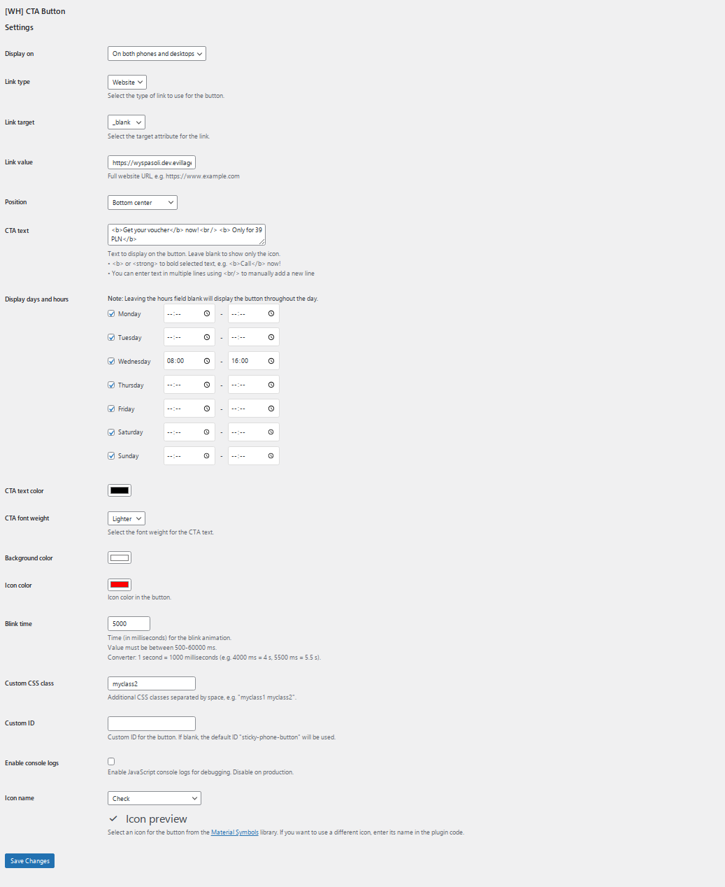

# Wordpress CTA Button - by WirtualnyHandlowiec.pl

A feature-rich WordPress plugin that displays a sticky Call-to-Action (CTA) button on all devices, allowing visitors to instantly connect or take action. The button can be fully customized in terms of position, display times, colors, and target actions.



## Features

### Comprehensive Display Settings
- **Device Selection**: Display the button on mobile devices, desktops, or both
- **Position Control**: Place the button in any of the 8 positions (top, middle or bottom, combined with left, center or right)
- **Scheduling Options**: Configure the button to display on specific days and during specific hours
- **URL Filtering**: Advanced visibility control based on page URLs
  - **Show on URLs containing** (whitelist): Display button only on pages with specific URL fragments
  - **Hide on URLs containing** (blacklist): Hide button on pages with specific URL fragments
  - Exclude rules have priority over include rules
  - Debug mode support (ignores URL rules when `?debug=1`, `?forceCTA=1`, or `?show=1` is used)
- **Visibility Rules**: Show or hide the button based on various conditions

### Flexible Action Configuration
- **Multiple Link Types**:
  - Phone calls (`tel:` links)
  - Email links (`mailto:` links)
  - SMS messages (`sms:` links)
  - Regular URLs (`http/https` links)
- **Target Control**: Open links in the same tab or a new tab

### Extensive Customization
- **Material Icons**: Choose from a variety of Material Design icons for the button
- **Custom Styling**:
  - Button background color
  - Icon color
  - Text color
  - Font weight
  - Custom CSS classes and IDs
- **Border & Shape Control**:
  - Border radius (from square to fully circular buttons)
  - Border width, style, and color
  - 9 different border styles (solid, dashed, dotted, double, groove, ridge, inset, outset, none)
- **Shadow Effects**:
  - Enable/disable shadow
  - Shadow position (offset X/Y)
  - Shadow blur and spread control
  - Shadow color with transparency support
  - Inset (inner) shadow option
- **Animation Effects**: Configurable pulsing animation with adjustable timing

### Advanced Features
- **Debug Mode**: Enable console logging for troubleshooting
- **REST API Integration**: Settings are exposed via a REST API endpoint for advanced integrations
- **Cache Prevention**: Implements measures to avoid caching issues
- **High Performance**: Optimized JavaScript for minimal impact on page load speed
- **Mobile Optimization**: Responsive design ensures proper display on all device sizes
- **Time-Based Visibility**: Automatically shows/hides the button based on configured time ranges

## Installation

### Method 1: WordPress Dashboard

1. Go to Plugins → Add New in your WordPress admin panel
2. Search for "Wordpress CTA Button"
3. Click "Install Now" and then activate the plugin

### Method 2: Manual Installation

1. Download the plugin from [GitHub repository](https://github.com/rskonieczka/wordpress-cta-button/archive/refs/heads/main.zip)
2. Upload the plugin files to the `/wp-content/plugins/sticky-phone-button` directory, or install the plugin through the WordPress plugins screen directly
3. Activate the plugin through the 'Plugins' screen in WordPress
4. Configure the plugin settings via the 'Wordpress CTA Button' option in the WordPress Settings menu

### Requirements
- WordPress 5.0 or higher
- PHP 7.2 or higher
- Modern web browser

## Configuration

### Basic Setup
1. Navigate to Settings → Wordpress CTA Button in your WordPress admin panel
2. Choose the devices you want to display the button on (mobile, desktop, or both)
3. Select the link type (phone, email, URL, SMS)
4. Enter the link value (phone number, email address, URL, etc.)
5. Choose the button position on the screen
6. Configure the CTA text (if needed)
7. Select days and hours for button display
8. Customize colors and icon

### Advanced Options
- **URL Filtering**: Configure whitelist/blacklist rules for specific pages
- **Border Customization**: Set border radius, width, style, and color
- **Shadow Effects**: Control shadow position, blur, spread, color, and inset options
- **Custom CSS**: Add custom CSS classes or IDs for additional styling
- **Debug Mode**: Enable console logs and testing parameters
- **Animation**: Adjust blink animation timing
- **Typography**: Configure font weight and text appearance

### URL Filtering Examples
```
Show on URLs containing (whitelist):
product
/shop/
category

Hide on URLs containing (blacklist):
contact
/admin/
checkout
```

### Border & Shadow Examples
```
Border Radius:
50px - rounded corners (default)
0px - square corners
25px - slightly rounded
50% - fully circular

Shadow Effects:
0px 2px 10px rgba(0,0,0,0.3) - subtle drop shadow
2px 2px 5px rgba(0,0,0,0.5) - offset shadow
inset 0px 2px 4px rgba(0,0,0,0.2) - inner shadow
```

## Testing

The plugin includes several debug parameters that can be added to any page URL to test functionality:

- `?debug=1`: Forces the button to show regardless of device settings and URL filtering rules
- `?alwaysShowCTA=1` or `?forceCTA=1`: Always displays the button ignoring time-based rules and URL filters
- `?show=1`: Forces button display ignoring all visibility conditions
- `?forceInit=1`: Forces button initialization

### Debug Examples
```
https://yoursite.com/contact/?debug=1
https://yoursite.com/admin/?forceCTA=1
https://yoursite.com/checkout/?show=1
```

**Note**: Debug parameters override URL filtering rules, making testing easier during development.

## Technical Details

### REST API
The plugin exposes settings via a REST API endpoint:
```
/wp-json/sticky-phone-button/v1/settings
```

### Ajax Endpoint
For backward compatibility, an Ajax endpoint is also available:
```
/wp-admin/admin-ajax.php?action=sticky_phone_button_get_settings
```

### Custom HTML Structure
The button is rendered with the following HTML structure:
```html
<div id="sticky-cta-container" class="sticky-phone-button sticky-position-class custom-class" style="custom-styles">
    <a href="link-target" target="_blank" class="sticky-phone-button-link">
        <span class="material-symbols-outlined">icon_name</span>
        <span class="sticky-phone-button-text">CTA Text</span>
    </a>
</div>
```

## Browser Compatibility

- Chrome (latest)
- Firefox (latest)
- Safari (latest)
- Edge (latest)
- Mobile browsers (iOS Safari, Android Chrome)

## Version History

### 1.4 (Current)
- **URL Filtering System**: Advanced whitelist/blacklist functionality for URL-based visibility control
- **Border & Shape Control**: Complete border customization (radius, width, style, color) with 9 border styles
- **Shadow Effects**: Full box-shadow management (enable/disable, position, blur, spread, color, inset option)
- **Enhanced Styling**: Dynamic CSS generation for all new visual options
- **Debug Mode Improvements**: URL filtering respects debug parameters for testing
- **Backward Compatibility**: All existing settings preserved during updates

### 1.3
- Added Material Icons integration
- Improved caching prevention
- Enhanced debug mode functionality
- Added REST API endpoint

### Previous Versions
- Initial release with core functionality
- Added scheduling options
- Implemented customization features

## License

**Free to Use - GPL v2**

This plugin is released under the GPL v2 (GNU General Public License version 2) or later.

### What GPL v2 means:
- You are free to use, modify, and distribute the plugin
- If you distribute modified versions, you must keep them under GPL
- The source code must be made available
- No warranty is provided

This plugin is free to use for all purposes. However, if you need an invoice or official documentation for your commercial use, please purchase a license.

### Paid License with Invoice
- One-time payment for a single domain
- Includes official invoice for business documentation
- No recurring fees
- **Business Benefits:**
  - Tax-deductible expense for your company
  - Proper accounting documentation for audits
  - Proof of legal software acquisition
  - Compliance with business software regulations
  - Priority email support
- Purchase online: [Buy license with invoice](https://buy.stripe.com/6oEcP3fJ90lN6oo9AK)

## Credits

Developed by [Wirtualny Handlowiec](http://wirtualnyhandlowiec.pl/)

---

For support or feature requests, please contact the developer through the website: [http://wirtualnyhandlowiec.pl/](http://wirtualnyhandlowiec.pl/)
